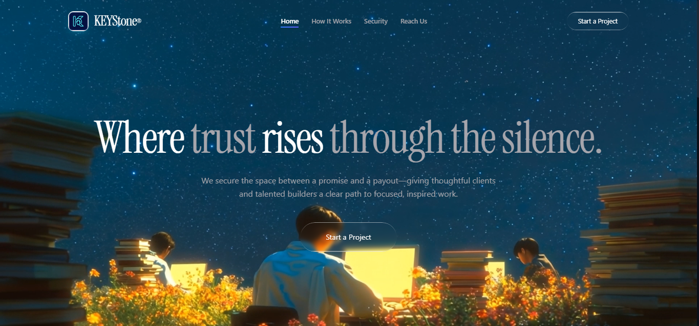

# KEYstone 🔑

**KEYstone** is an escrow-protected freelancing and project-governance platform designed to make remote work safe. By locking client funds in custody and releasing them only on milestone approval, KEYstone turns risky gigs into accountable work journeys.

Clients post milestones with budgets and deadlines, freelancers submit checkpoints with proof of work, and every fund move — `IN_CUSTODY → FROZEN → WITHDRAWABLE → PAID` — is written to an immutable ledger. With 90/10 fair rejection, 7-day auto-unlock protection, and admin arbitration, nobody delivers without pay and nobody pays without delivery. So that no freelancer fears delivering work without getting paid.

## 🌟 Key Features

### 🤝 Milestone & Escrow Protection
- **Secure Funds:** Clients lock full budget in escrow on project creation with `FUND_DEPOSITED` ledger proof.
- **Checkpoint Flow:** Freelancers submit demo/GitHub proof, clients approve to release `FROZEN → WITHDRAWABLE → PAID`.
- **Open & Invited Hiring:** Post to marketplace or invite directly, with application deadlines and offer accept/reject.

### 🛡️ Ironclad Trust & Ledger
- **Immutable Ledger:** Every deposit, freeze, release, refund, dispute and payout is append-only with hash + timestamp.
- **Reputation System:** TrustScore 0-100 from profile completeness, completed projects, and on-time rate, plus completion badges.
- **Live Tracking:** FundLifecycleVisualizer, FundStateBadge, TimelineVisualizer, and system chat events for full transparency.

### 🚨 Disputes & SOS Tools
- **One-Tap Dispute:** Either party can freeze funds to `DISPUTED` and alert counterparty + admin instantly.
- **90/10 Fair Resolution:** Rejected work auto-splits 90% refund to client, 10% to builder — no deadlock.
- **Auto-Unlock & Kill-Fee:** 7-day inactivity auto-releases pay, client cancel pays 30% kill-fee, admin can custom-split.

## 🛠️ Technology Stack

- **Frontend:** React 19 + Vite, Tailwind CSS v4, Zustand, Lucide React, Recharts
- **Backend/Database:** Node.js, Express, MongoDB + Mongoose (User, Project, LedgerEntry, Dispute, Message, Notification, Report)
- **Auth & Verification:** Google OAuth (`google-auth-library`), SMTP OTP via Nodemailer
- **AI Talent Matching:** Gemini `gemini-2.5-flash` server-only (`POST /api/ai/talent-search`) with fallback ranking
- **State Management:** Zustand

## 🚀 Getting Started

### Prerequisites
- Node.js (v20+ recommended)
- MongoDB local or MongoDB Atlas account
- Gmail App Password for OTP + Google OAuth Client ID for Sign-In

### Installation

1. **Clone the repository:**
   ```bash
   git clone https://github.com/Aritra7070/KeyStone.git
   cd KeyStone/KEYstone
   ```

2. **Install dependencies:**
   ```bash
   npm install
   ```

3. **Environment Setup:**
   Create a `.env` file in the root based on `.env.example`:
   ```env
   PORT=5000
   MONGODB_URI=mongodb://localhost:27017/keystone
   GEMINI_API_KEY=your_server_only_gemini_key
   GEMINI_FAST_MODEL=gemini-2.5-flash
   SMTP_HOST=smtp.gmail.com
   SMTP_PORT=587
   SMTP_USER=your_email@gmail.com
   SMTP_PASS=your_gmail_app_password
   SMTP_FROM=your_email@gmail.com
   AUTH_OTP_SECRET=replace_with_a_long_random_secret
   GOOGLE_CLIENT_ID=your_google_client_id.apps.googleusercontent.com
   ```

4. **Start the Development Servers:**
   ```bash
   npm run dev:all
   ```
   - Frontend: http://localhost:5173
   - Backend API: http://localhost:5000
   - Health: http://localhost:5000/api/health

## 📚 API & Core Services
For escrow lifecycle, milestone approvals, 90/10 resolution, and AI talent search, see server routes:
`server/routes/projects.ts`, `ledger.ts`, `disputes.ts`, `payouts.ts`, `ai.ts`
